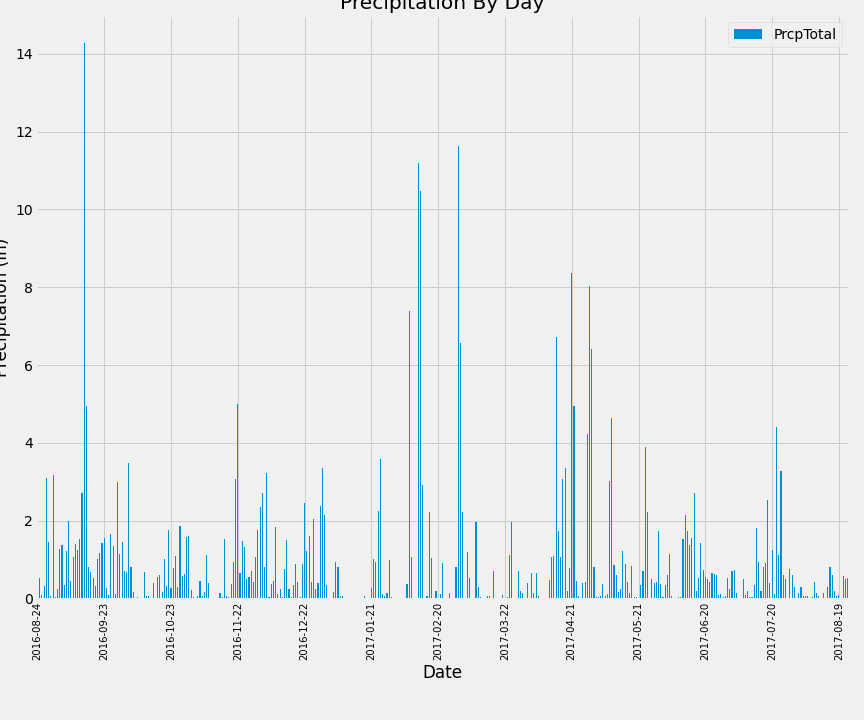
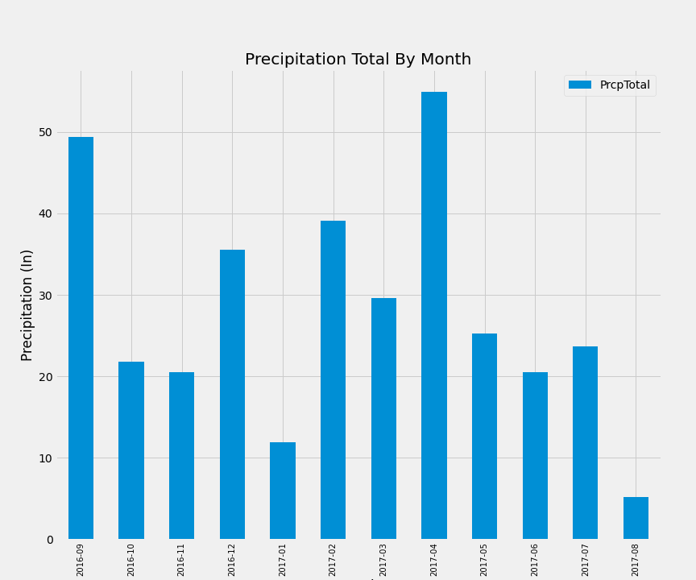
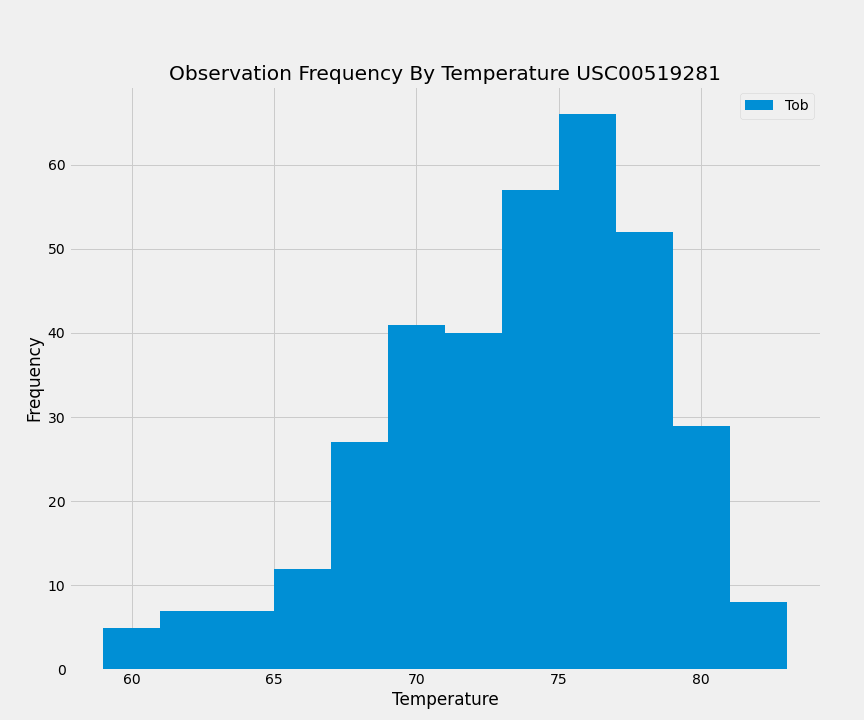

# SQLAlchemy Challenge

##Challenge Objectives
The goal of the challenge is to provide expert data analysis related to Hawaiin precipitation and temperature observations data that was colleceted by numerous weather station in the area. The data is stored in a SQLLite database.  This challenge requires the use of the following skills:

- SQLAlchemy 
- Jupyter Notebooks
- andas
- Matplotlib
- Python
- Mild HTML

## Basic Analysis Requirements
The following section offers basic analysis of the station and correspondinge weather obsevation data.  The source code created to perform the analysis is saved in a Jupyter Notebook in the main folder of the GitHub repository [climate_analysis.ipynb](https://github.com/mregpala/sqlalchemy-challenge)

The first component of the analysis is to provide a plot of total precipitation by day for the last 12 months of precipitation data.  The following is the bar chart:

Additionally, the followng is a plot of the same data but rolled at month level:

**Summary Statistics of Data**

    - Mode: 0.0
    - Mean: 0.974
    - Median: 0.40
    - Standard Deviation: 1.776
    - Quartiles: .25 = .05, .50 = 1.08
    - Outliers: Above 2.625 

**Station Analysis**
- There are 9 stations recording observations that are represented in the data.
- The following is a list of stations and total observation count ordered from most to least.
    1. USC00519281 - 2772
    2. USC00519397 - 2724
    3. USC00513117 - 2709
    4. USC00519523 - 2669
    5. USC00516128 - 2612
    6. USC00514830 - 2202
    7. USC00511918 - 1979
    8. USC00517948 - 1372
    9. USC00518838 -  511

 - Utilizing the above list we were able to identify the station with the most obsevations and plot a histogram based on frequency of temperature observed.

 ## Cimate App
 Utilzing the Flask API platform, I was able to create the following API routes:

 - **/api/v1.0/stations** - List all stations
 - **/api/v1.0/tobs** - Returns temperature observations of most active station for the last year of data. 
 - **/api/v1.0/stats/<start>** - Returns TMIN, TAVG, TMAX greater than equal to start date.
 - **/api/v1.0/stats/<start>/<end>** - Returns TMIN, TAVG,TMAX for observations between start and end date.

## Additinonal Temperature Analysis (Part 1)
An optional requirements challenge is to determine if there is a meaningful difference in average temperature for the month of June versus the month of December.  

Time based results from the same population are being studied to determine if the month of the year significantly impacts temperature. Since the same population of stations are being used and we're comparing paired observation outcomes using a paired T test is appropriate.

HO: There is no significant difference between June and December average temperature

HA: There is a significatn difference between Jane and December average temperatures

The following is the paired observations by station:
| Station        | June         | December     |
| :------------- | :----------: | -----------: |
| USC00511918    | 74.139394    | 69.684211    |
| USC00513117    | 74.050847    | 71.069444    |
| USC00514830    | 76.005376    | 73.224719    |
| USC00516128    | 71.937220    | 69.291262    |
| USC00517948    | 76.655405    | 71.834862    |
| USC00518838    | 73.394737    | 72.421053    |
| USC00519281    | 73.271186    | 69.903226    |
| USC00519397    | 77.559322    | 71.109524    |
| USC00519523    | 76.668103    | 72.433333    |

**Results of Paried T Test**
With P-Value of.00012 and less than .05 we can reject the null hypothesis and report that there is sufficient evidence that the average temperature of the months June and December are significantly different.

